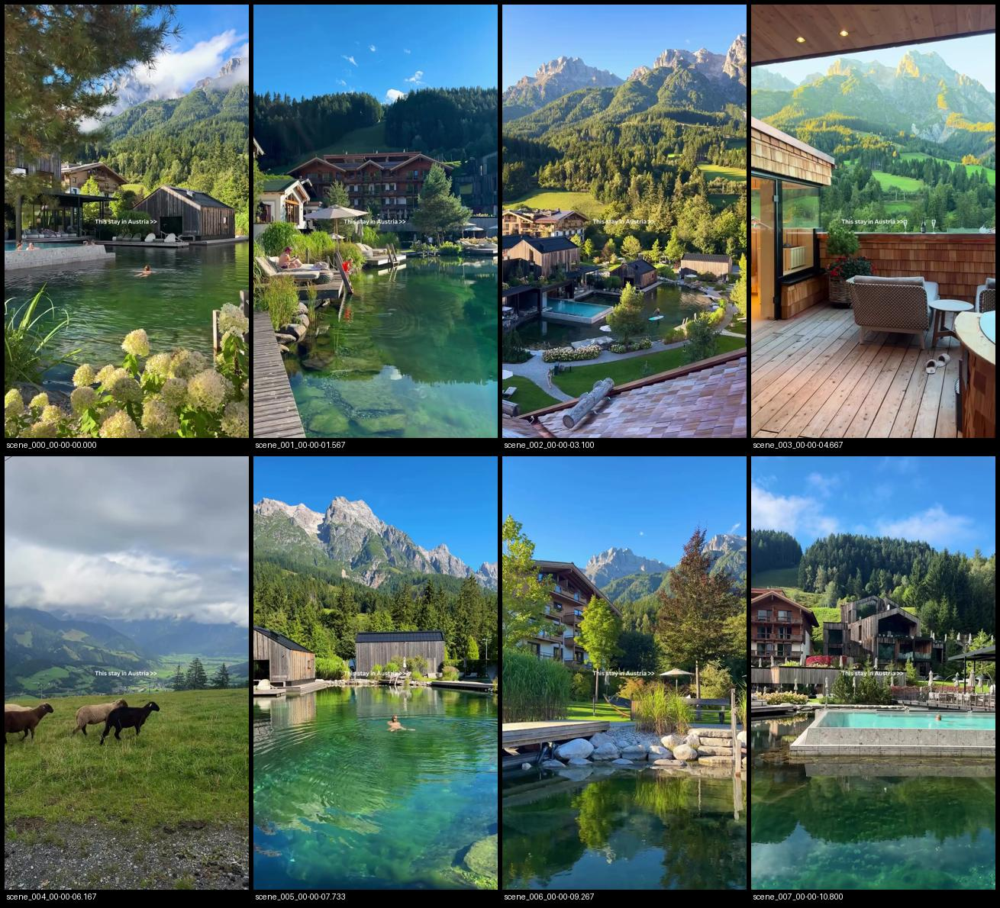

# Reel analysis

**Source:** `DXCkOJxjdnb.mp4`

## Technical
- **Duration:** 12.466259 s
- **Resolution:** 720x1280 @ 30.0 fps
- **Video codec:** h264  |  **Audio:** aac
- **Bitrate:** 3538 kbps  |  **Size:** 5.51 MB

## Transitions — 8 scene(s) detected
- Shortest 1.5s · longest 1.567s · avg 1.55s

| # | start | end | duration | frames |
|--|--|--|--|--|
| 0 | 00:00:00.000 | 00:00:01.567 | 1.567s | 0-47 |
| 1 | 00:00:01.567 | 00:00:03.100 | 1.533s | 47-93 |
| 2 | 00:00:03.100 | 00:00:04.667 | 1.567s | 93-140 |
| 3 | 00:00:04.667 | 00:00:06.167 | 1.5s | 140-185 |
| 4 | 00:00:06.167 | 00:00:07.733 | 1.567s | 185-232 |
| 5 | 00:00:07.733 | 00:00:09.267 | 1.533s | 232-278 |
| 6 | 00:00:09.267 | 00:00:10.800 | 1.533s | 278-324 |
| 7 | 00:00:10.800 | 00:00:12.367 | 1.567s | 324-371 |

